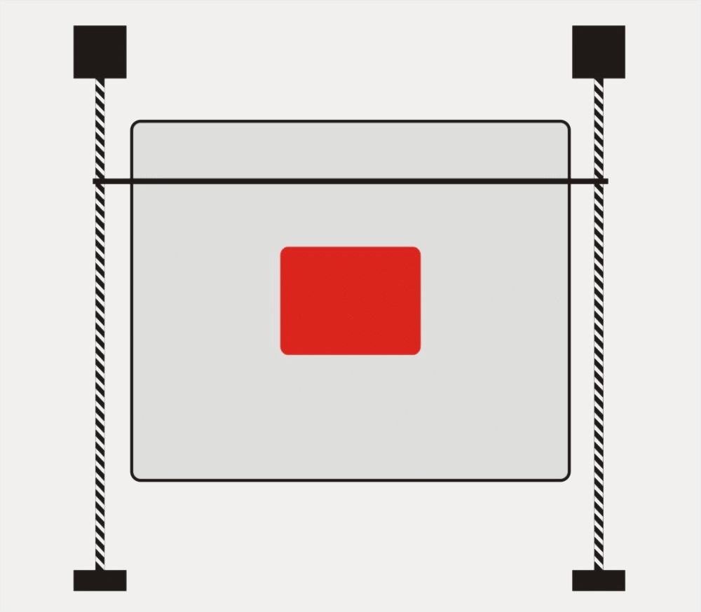
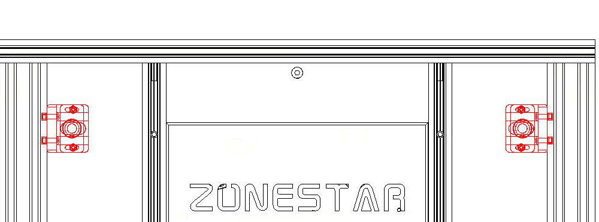
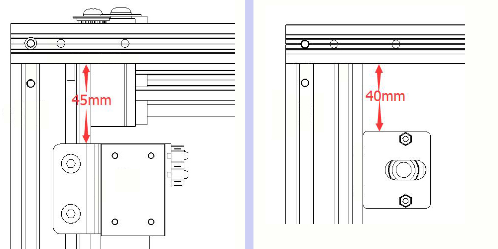
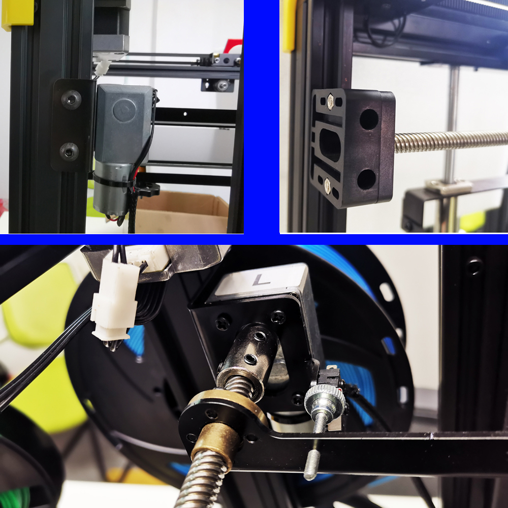
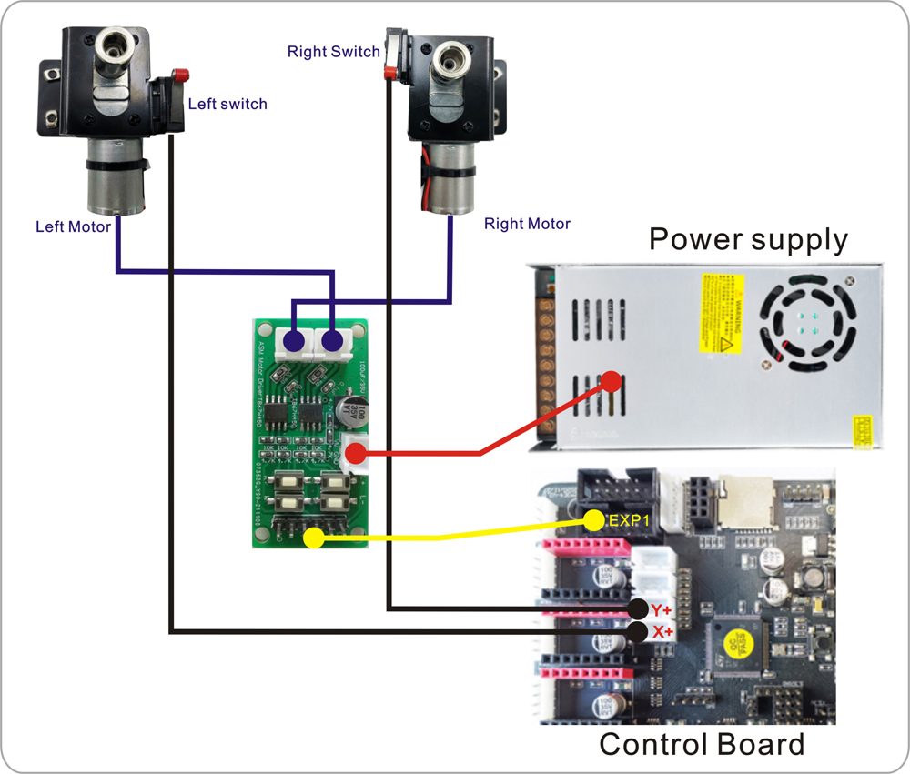
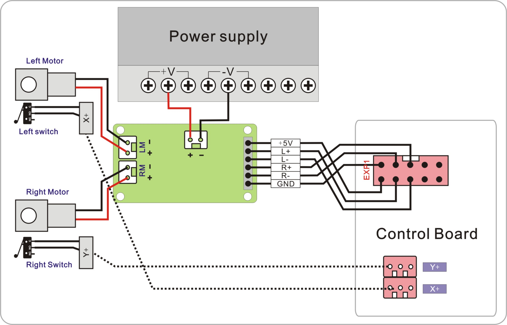
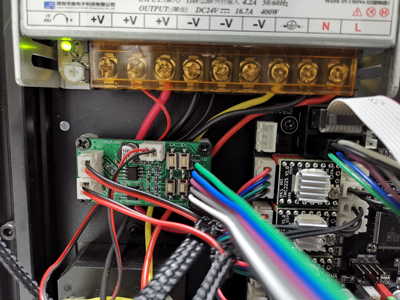
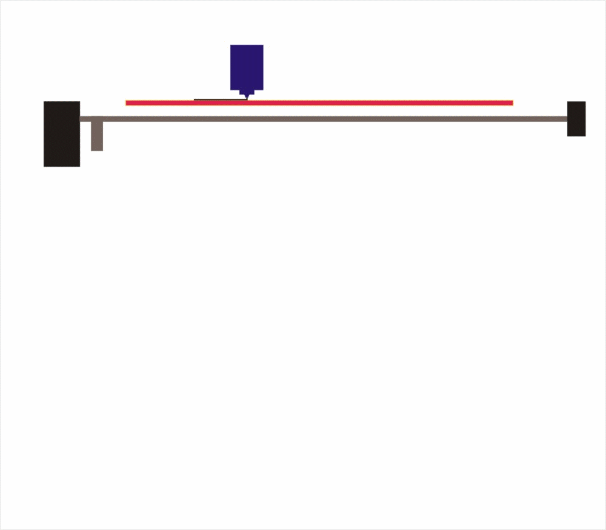
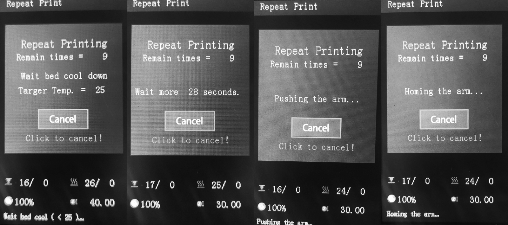

# [Automatic Repeat Printing Module][selllink] User Manual
## :warning::bangbang:ATTENTION:bangbang:
#### 1. Before using Automatic Repeat Printing feature, please confirm that the prints is easy to be removed from the printing platform while the hotbed is cooled. For details, please refer to [Important Notice][7]
#### 2. Remove the M84 command from the "End G-code" of "machine setting" of slicing software.
#### 3. It is recommended to purchase one 4-IN-1-OUT Non-mixing color hotend if you haven't it,  its printing quality is better than mixing color hotend when printing one color 3d prints. [Click Here to buy](https://www.aliexpress.com/item/1005002951777699.html)

## Contents
* [**1. Brief introduction**][1]  
* [**2. Parts list**][2]
* [**3. Installation**][3]  
* [**4. Wiring**][4]
* [**5. Upgrade firmware**][5] 
* [**6. Verify wiring and installation**][6]  
* [**7. Important Notice**][7]  
* [**8. Workflow of Automatic Repeat Printing**][8]
* [**9. Apply Automatic Repeat Printing function**][9]
* [**10.Example Gcode files**][10]
* [**11.Advanced features**][11]

## 1. Brief introduction   [return to contents>>][0]
Sometimes we hope to use the 3D printer to make some plastic parts in small quantities (dozens or hundreds). In this case, we need a device to automatically remove the 3D printed object on the hot bed and print this part repeatedly, so that the 3D printer can realize unattended automatic repeated production.  [**Automatic Repeat Printing Module**][selllink] is an upgrade kit for Z9 to meet this requirement.     
**The premise that the [Automatic Repeat Printing Module][selllink] can work normally is that the printed 3D printed object can be easily separated from the printing platform after the printing platform is cooled.** According to our test, if we were used the glass printing platform and properly set the printing height of the first layer, the printed object (made by ABS, PLA+ or PETG filament etc.) can be easily separated from the glass printing platform after the glass is cooled to below 25℃.    
The **[Automatic Repeat Printing Module][selllink]** is composed of **Arm Drivers, lead screw fixing blocks, lead screws and Pushing-arm**. It is installed between the hot bed and the hot end. 
The working process is that finished one print first, then cooling the printing platform, and then push the printed object out of the printing platform with the Pushing-arm, and then print the next one repeatedly.  

## 2. Parts list   [return to contents>>][0]  
    
* **Left Arm Driver Assembly with limit switch(1).**    
* **Right Arm Driver Assembly with limit switch(2).**   
* **Drive board(3).**     
* **Pushing-Arm(4).**   
* **lead screws(5).**    
* **Lead Screw Fixing Blocks(6).**   
* **1 x 6Pin DuPont wire, 1 x 2Pin power wire with connector(7).**   
* **4 x M3x6 screws + 4x M3 Nylon pillar(8).**    

## 3. Installation   [return to contents>>][0]
### 3.1 Install the arm driver assemblies.

###  3.2 Install lead screw fixing blocks.

###  3.3 Install Pushing-arm and lead screws.

## 4. Wiring   [return to contents>>][0]

## 5. Upgrade firmware   [return to contents>>][0]
Download firmware bin file and upload to your 3d printer.  
[**Z9V5-MK1 & Z9V5-MK2** firmware with **repeat print feature**](firmware/Z9V5-MK1(MK2))   
[**Z9V5-MK3** firmware with **repeat print feature**](firmware/Z9V5-MK3)   
  
>**How to upload firmware**  
> 1. Download the zip file and unzip it.  
> 2. Copy ***firmware.bin*** to the root directory of Micro-SD card.   
> **NOTE:if there is a "old_fw.bin" in the SD card, delete it first.** 
> 3. Power off 3d printer and plug the SD card into card socket of control board.
> 4. Power on the printer, push the power button and wait about 30 seconds.  
> 5. Do the below step on LCD screen to initialize EEPROM after upload firmware:  
>   `MENU: Control>>Restore Defaults`  
> 6. Check the firmware version on LCD screen:    
> 	`MENU: Infor>>Firmware Version` 

## 6. Verify wiring and installation   [return to contents>>][0]
* **Step 1**: Power on the 3d printer.  
* **Step 2**: Push the buttons on the drive board, and check if the motor rotate as below:
	* **Click L+ button**: the left motor rotate clockwise.
	* **Click L- button**: the left motor rotate anti-clockwise.
	* **Click R+ button**: the right motor rotate clockwise.
	* **Click R- button**: the right motor rotate anti-clockwise.
* **Step 3**: Operature the LCD MENU: ***Control>>Repeat Print***
	* **ATTENTION: Make sure the arm is above the hot bed before testing**
	* Move to MENU ***Repeat Printing:*** and click knob to turn ***Repeat Printing: ON***.
	* Move to MENU ***Home Arm Test***, click knob, the arm will move back and stop when the ENDSTOPs it triggered.
	* Move to MENU ***Push Arm Test***, click knob, the arm will move front 340mm.

## 7. Important Notice   [return to contents>>][0]
* Before using Automatic Repeat Printing feature, please confirm that the printed object is easy to be removed from the printing platform while the hotbed is cooled. It is recommended that you print and confirm this before using Automatic Repeat Printing. 
* The following methods will help to remove the printed object from the printing platform:
	* Put the smooth surface of the glass upward, if the print does not attach well to the platform, you can try the following solution:
		* Set the hot bed temperature to 70 degrees (PLA, PLA +), or 85 degrees (PETG)
		* Set the height of the first floor to 0.4mm and the printing speed to 10mm / s
	* Do not use "Brim" or "Raft" on "Build Plate Adhesion" settings when slicing.
* Please note that the glass printing platfome may be pushed out of the hot bed  while removed the printed object. It is suggested that you put foam under the machine to prevent the glass is damaged because of falling down. You may also consider using adhesive to paste glass on the hot bed substrate to instead of fixed by clips.

## 8. Workflow of Automatic Repeat Printing   [return to contents>>][0]
A complete workflow of repeated printing is:   
**[Print]->[Wait bed cool]->[Move up hotbed]->[Push the arm]->[Home the arm]->[Print next one]**.     
   

### Description of settings:  
+ **Auto repeating**: Turn on or turn off the **Automatic Repeat Print**.  
+ **Repeat times:** Number of repeat, obviously the actual printed number = Repeat times + 1.
+ **Push length:** Puhing-arm move forward length when removing the printed object. 
+ **Bed temp:** Wait the hotbed cool to this temperature before removing the printed object.
+ **Z Heigth:** Move Z-axis to this heigth before removing the printed object.  
+ **Base Heigth:** Heigth of the base. [**See advanced feature for details**][11]  

## 9. Apply Automatic Repeat Printing function   [return to contents>>][0]
There are two ways to apply the **Automatic Repeat Printing function**: ***Apply from LCD control panel*** or ***Apply by adding gcode in slicing software***.    
### 9-1. Apply Automatic Printing function from LCD control panel.
+ Slice the 3d files to gcode file, which is the same as without **Automatic Repeat Printing** function.
+ Turn on the Repeat Printing and set parameters on the LCD screen.  

### 9-2. Apply Automatic Printing function by adding gcode in slicing software.
You can also add the M182 command to the "Start G-code" of "machine setting" when slicing, detailed description of M182 command as below: 

    M182 Sx Nxx Zxx Txx Lxx

	//M182 command decscription
	M182: set Automatica Repeat Printing settings.  
	S[bool]: enable (= 1) or disable(= 0) auto repeat printing.  
	N[int]:  Repeat Printing times (1~999).  
	Z[int]:  Move Z axis to this heigth before pushing the arm.  
	T[int]:  Bed temperature (15~100).  
	L[int]:  Push arm length.  
	B[float]: Base heigth. (while used the print base)

	:memo:For example:
	 >>1. Need to print 10 pieces total. 
	 >>2. The hotbed temperature should be lower than 23℃ before removing. 
	 >>3. Move printing platform heigth to 65mm before removing.
	 >>4. Pushing the arm 350mm to remove the printed object.  
	you can add this command to the start G-code (before G28 command):
	M182 S1 N9 Z65 T23 L350 
 

## 10. Example Gcode files   [return to contents>>][0]
There are several testing gcode files in the [**Example**](./Example) directory:      

+ **Dummy.gcode**: This file is a "dummy" print file. It doesn't actually print anything, only help to test the repeat printing function quickly. You can download and copy this file to the SD card and followng the below steps to tes  *Automatic Repeat Printing* function:  
	+ **Step 1**. Turn on **Repeat Printing** and set the parameters on the LCD screen.
	+ **Step 2**. Start print *dummy.gcode* file from SD card, and watch the printer how to work.
   

+ **ShowHow.gcode**: This file is a "dummy" print file too, but a M182 command has been added in the "start Gcode" when slicing, you can download and copy the file to the SD card and print it and watch the printer how to work (don't need to set "Repeat Print" settings on LCD screen).
  
> **The below picture shows what's different between file "Dummy.gcode" with "ShowHow.gcode".**

+ **Demo.gcode**: This file is a "demo" print file. It print a small box with 30x30x50mm size. It can help you test the repeat printing function. the steps are as follows:  
	* **Step 1**. Turn off **Repeat repeating** on the LCD screen,
	* **Step 2**. Start print "Demo.gcode" file from SD card.
	* **Step 3**. Pay attention to adjust the heigth when printing first layer.
	* **Step 4**. Wait for printing finish.
	* **Step 5**. Wait the hotend cool down,  depending on the ambient temperature and it shoudl be lower than 25 degree.
	* **Step 6**.  Do **Prepare>>Move Axis>>Move Z** to move the Z axis to about 40mm.
	* **Step 7**.  Do **Control>>Repeat Print>>Push Arm Test** on the LCD MENU to push the arm and check if the printed object can be removed by the arm. 
If the above operation can successfully remove the printed object, you can start the repeat printing function on the LCD menu and test it.
+ **DemoRep.gcode**: This file is almost the same with **Demo.gcode**, but a M182 command is added in the "start G-code" while slicing, so you can print it directlly but don't need to turn on the "Repeat Printing" settings from LCD screen.

## 11. Advanced feature    [return to contents>>][0]
### 11-1. Print another gcode file
If you want to print another gcode file after finished, you can add an M183 command before the M182 command.    
> 
    M183 command description
    M183: Set the repeat printing file.  
    Example: M183 12345678.gco -> print file "12345678.gco"  

**:exclamation:Note:exclamation:The file name must be in 8.3 format and placed in the same directory with the previous file (it is recommended to place them in the root directory).**  
:memo:For example, you want to print 3d object "A" 7 copies and print 3d object "B" 3 copies, you need to:  
  
+ Add the below commands on the "start g-code" when slicing 3d model "A"
  
>
    M182 S1 N6 Zxx Txx Lxxx   
    M183 b.gco 
	;xx needs to be set as required 	

+ Add the below commands on the "start g-code" when slicing 3d model "B"

>    
    M182 S1 N2 Zxx Txx Lxxx  
	;xx needs to be set as required

+ Store the a.gco and b.gco to the same directory and print "a.gco" file first. 

### 11-3. Add bed cooling FAN
:black_square_button: **TODO: To add an instruction about how to add the hot bed cooling fan.**
### 11-2. Add print base
:black_square_button: **TODO: To add an instruction about how to add a base under the printed object.**  

[0]:https://github.com/ZONESTAR3D/Upgrade-kit-guide/tree/main/Auto_Repeat_Printing#contents
[1]:https://github.com/ZONESTAR3D/Upgrade-kit-guide/tree/main/Auto_Repeat_Printing#1-brief-introduction---return-to-contents
[2]:https://github.com/ZONESTAR3D/Upgrade-kit-guide/tree/main/Auto_Repeat_Printing#2-parts-list---return-to-contents
[3]:https://github.com/ZONESTAR3D/Upgrade-kit-guide/tree/main/Auto_Repeat_Printing#3-installation---return-to-contents
[4]:https://github.com/ZONESTAR3D/Upgrade-kit-guide/tree/main/Auto_Repeat_Printing#4-wiring---return-to-contents  
[5]:https://github.com/ZONESTAR3D/Upgrade-kit-guide/tree/main/Auto_Repeat_Printing#5-upgrade-firmware---return-to-contents  
[6]:https://github.com/ZONESTAR3D/Upgrade-kit-guide/tree/main/Auto_Repeat_Printing#6-verify-wiring-and-installation---return-to-contents
[7]:https://github.com/ZONESTAR3D/Upgrade-kit-guide/tree/main/Auto_Repeat_Printing#7-important-notice---return-to-contents
[8]:https://github.com/ZONESTAR3D/Upgrade-kit-guide/tree/main/Auto_Repeat_Printing#8-workflow-of-automatic-repeat-printing---return-to-contents 
[9]:https://github.com/ZONESTAR3D/Upgrade-kit-guide/tree/main/Auto_Repeat_Printing#9-apply-automatic-repeat-printing-function---return-to-contents
[10]:https://github.com/ZONESTAR3D/Upgrade-kit-guide/tree/main/Auto_Repeat_Printing#10-example-gcode-files---return-to-contents 
[11]:https://github.com/ZONESTAR3D/Upgrade-kit-guide/tree/main/Auto_Repeat_Printing#11-advanced-feature----return-to-contents
[selllink]:https://www.aliexpress.com/item/1005003767078457.html

