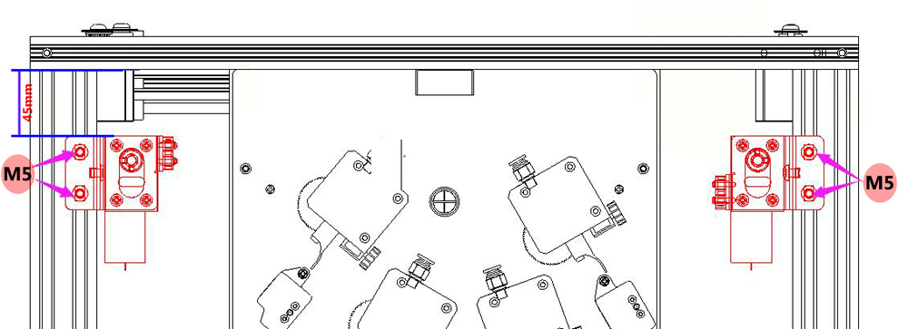
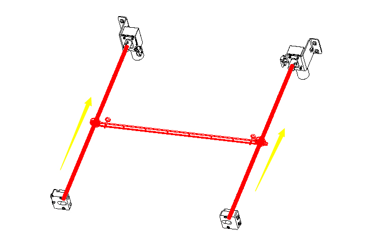

## Automatic Repeat Printing Module User Manual
### !!ATTENTION!!
**Before using Automatic Repeat Printing feature, please confirm that the prints is easy to be removed from the printing platform while the hotbed is cooled. For details, please refer to [Special Notes](#7)**

### 1. Brief introduction   
**Sometimes we hope to use the 3D printer to make some plastic parts in small quantities (dozens or hundreds). In this case, we need a device to automatically remove the 3D prints on the hot bed and print this part repeatedly, so that the 3D printer can realize unattended automatic repeated production.  [**Automatic Repeat Printing Module**][selllink] is upgrade kit for Z9 to meet this requirement.**

### 2. Parts list  
    
* **1 x Left Arm Driver Assembly with limit switch.**[1]    
* **1 x Right Arm Driver Assembly with limit switch.**[2]   
* **1 x Drive Board.** [3]    
* **1 x metal pushing Arm.**[4]   
* **2 x T8 445mm lead screws.**[5]    
* **2 x T8 Lead Screw Fixing Blocks.**[6]   
* **1 x 6Pin DuPont wire, 1 x 2Pin power wire with connector.**[7]   
* **4 x M3x6 screws + 4x M3 Nylon Pillar.**[8]    

### 3. Installation
#### 3.1 Install the arm driver assembly.

####  3.2 Install lead screw fixing blocks.

####  3.3 Install arm and lead screws.

<h3 id="4">4. Wiring</h3>
<h4> Please refer to the below pictures to wiring </h4>

<h3 id="5">5. Upgrade firmware</h3>
Download firmware and upload to your 3d printer.  
[**Z9V5-MK1 & Z9V5-MK2** firmware with **repeat print feature**](https://github.com/ZONESTAR3D/Firmware/tree/master/Z9/Z9V5/bin/Z9V5Pro/beta/RepeatPrint)   
[**Z9V5-MK3** firmware with **repeat print feature**](https://github.com/ZONESTAR3D/Firmware/tree/master/Z9/Z9V5/bin/Z9V5Pro-MK3/beta/RepeatPrint)   

> 
**How to upload firmware**  
1. Download the zip file and unzip it.  
2. Copy ***firmware.bin*** to the root directory of Micro-SD card.   
**NOTE:if there is a "old_fw.bin" in the SD card, delete it first.** 
3. Power off 3d printer and plug the SD card into card socket of control board.
4. Power on the printer, push the power button and wait about 30 seconds.  
5. Do the below step on LCD screen to initialize EEPROM after upload firmware:
    `MENU: Control>>Restore Defaults`  
6. Check the firmware version on LCD screen:    
	`MENU: Infor>>Firmware Version` 

<h3 id="6">6. Verify wiring and installation</h3>
* **Step 1**: Power on the 3d printer.  
* **Step 2**: Push the buttons on the drive board, and check if the motor rotate as below:
	* **Click L+ button**: the left motor rotate clockwise.
	* **Click L- button**: the left motor rotate anti-clockwise.
	* **Click R+ button**: the right motor rotate clockwise.
	* **Click R- button**: the right motor rotate anti-clockwise.
* **Step 3**: Operature the LCD MENU: ***Control>>Repeat Print***
	* **ATTENTION: Make sure the arm is above the hot bed before testing**
	* Move to MENU **Repeat Printing: OFF**, and click knob to turn ON.
	* Move to MENU **Home Arm Test***, click knob, the arm will move back and stop when the ENDSTOPs it triggered.
	* Move to MENU **Push Arm Test***, click knob, the arm will move front 340mm.

<h3 id="7">7. Special Notes</h3>
* Before using Automatic Repeat Printing feature, please confirm that the prints is easy to be removed from the printing platform while the hotbed is cooled. It is recommended that you print and confirm this before using automatic repeat printing. 
* The following methods will help to peel the print from the printing platform:
	* Put the smooth surface of the glass upward, if the print does not attach well to the platform, you can try the following solution:
		* Set the hot bed temperature to 70 degrees (PLA, PLA +), or 85 degrees (PETG)
		* Set the height of the first floor to 0.4mm and the printing speed to 10 ~ 15mm / s
	* Do not use "Brim" or "Raft" on "Build Plate Adhesion" settings when slicing.
* Please note that the glass printing platfome may be pushed out of the hot bed and damage when removing the prints. It is suggested that foam should be laid under the machine to prevent the glass from falling down. You may also consider using double-sided adhesive to paste hot bed glass on the hot bed aluminum substrate to instead of fixed by clips.

<h3 id="8">8. Workflow of Automatic Repeat Printing</h3>
A complete workflow of repeated printing is as follows:  
Print->Wait bed cool->Move up hotbed->Push the arm->Home the arm->Print next one
   

<h3 id="9">9. Apply Automatic Repeat Printing function</h3>
There are two ways to apply the **Automatic Printing function**: *Apply from LCD control panel* or *Apply by adding gcode in slicing software*.    
<h4> 1. Apply Automatic Printing function from LCD control panel.</h4>
+ Slice the 3d files to gcode file, which is the same as without Automatic Printing function.
+ Turn on the **"Auto repeating"** and set several parameters on the LCD screen.About the details of **several parameters**:  
	+ **Repeat times:** Number of times to repeat, obviously, the actual prints number is equal to Repeat times + 1.
	+ **Push length:** *PUSH ARM* move forward length when removing the print. 
	+ **Bed temp:** Wait the hotbed cooled to this temperature before removing the prints.
	+ **Z Heigth:** Move Z-axis to this height before removing the prints.
	+ **Base Heigth:** Height of the base while used the print base. [**More about the print base**](#a)

<h4> 2. Apply Automatic Printing function by adding gcode in slicing software
You can also add the below Gcode command in to the start Gcode of slicing software.

    M182 Sx Nxx Zxx Txx Lxx

	//M182 command decscription
	M182: set auto Repeat Printing settings.  
	S[bool]: enable (= 1) or disable(= 0) auto repeat printing.  
	N[int]:  Repeat Printing times (1~999).  
	Z[int]:  Move Z axis to this heigth before pushing the arm.  
	T[int]:  Bed temperature (15~100).  
	L[int]:  Push arm length.  
	B[float]: Base heigth. (while used the print base)

	For example, you want to print one 3d object 10 pieces, before remove the prints, the hotbed temperature lower than 23 degree. In order that the prints can be push down by the arm, the hot bed need to move to 60mm heigth and the arm need to push 350mm, you can add a command to the start G-code:
	M182 S1 N9 Z60 T23 L350 

	PS: Add this gcode before G28 command in "start G-code".
 

<h3 id="10">10. Example Gcode files</h3>
In the example directory, you can see several gcode files, which are:    

* **Dummy.gcode**: This file is a "dummy" print file. It doesn't actually print anything. It can help you quickly test the repeat printing function. the steps are as follows:  
	* **Step 1**. Turn on **Auto repeating** and set the parameters on the LCD screen.
	* **Step 2**. Start print "dummy.gcode" file from SD card, and watch the printer how to work.

* **ShowHow.gcode**: This file is a "dummy" print file too, but it has added M182 commands in to the "start Gcode" wile slicing, so you only need to start print "ShowHow.gcode" file from SD card, and watch the printer how to work.

* **Demo.gcode**: This file is a "demo" print file. It print a small box with 30mmx30mm size and 40mm heigth. It can help you test the repeat printing function. the steps are as follows:  
	* **Step 1**. Turn off **Repeat repeating** on the LCD screen,
	* **Step 2**. Start print "Demo.gcode" file from SD card.
	* **Step 3**. Pay attention to adjust the heigth when printing first layer.
	* **Step 4**. Wait for printing finish.
	* **Step 5**. Wait the hotend cool down,  depending on the ambient temperature and it shoudl be lower than 25 degree.
	* **Step 6**.  Do **Prepare>>Move Axis>>Move Z** to move the Z axis to appropriate heigth, it is okay about 40mm for this expample.
	* **Step 7**.  Do **Control>>Repeat Print>>Push Arm Test** on the LCD MEN to push the arm and check if the prints can be removed by the arm. 
If the above operation can successfully remove the prints, you can start the repeat printing function on the LCD menu and test it, or print "**DemoRep.gcode**" from SD card directly.

* **DemoRep.gcode**: This file is an "auto repeat printing demo" print file. It print a small box with 30mmx30mm size and 40mm heigth and repeat 10 times automatically. 

[selllink]:(https://www.aliexpress.com/item/1005002865311470.html)

<h4 id="a">print Base</h4>

