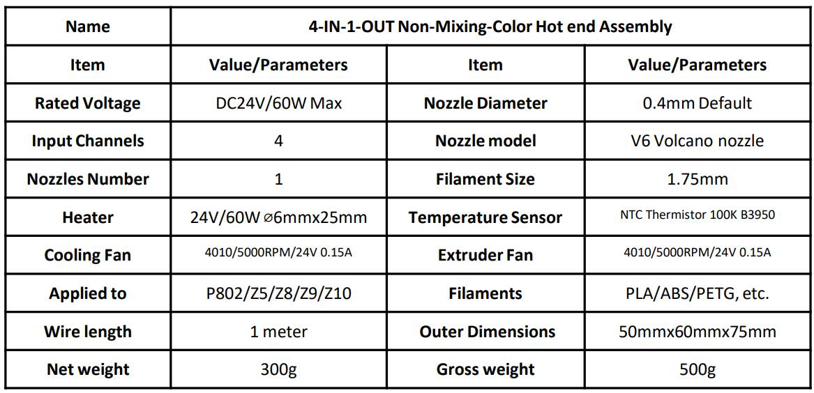
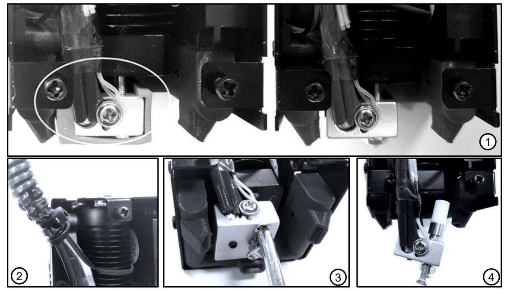

[**Buy E4 hotend**](https://www.aliexpress.com/item/1005002951777699.html)

## E4 Hotend user guide
### 1. Specifications
There are 4 input channels and 1 nozzles on the E4 hotend, when switching color, we need to pull out the previous color filament first and then load the next color filament.

### 2. Components

>
    1. Cooling Fan        2. Housing        3. Bed leveling sensor(optional)  4. Mounted Screws   5. Extruder Fan
    6. Fan Duck           7. Heating block  8. Heat sink                      9. Nozzle           10. Cartridge heater 
    11.Temperature sensor 12. Throat        13. Silicone sleeve               14. Fittings        15. Cable

### 3. Wire and Terminals

### 4. Installation
Simply remove the 3 screws behind the hot end assembly and install them on the machine X carrier.

### 5. Working principle
4-IN-1-OUT hot end is composed of fitting, heat-sink, heater, nozzle and other components, when printing, extrusion feeder insert this color filaments into the hot end, then the filament is melted and flowed from the nozzle.
While changing the color, the extrusion feeder needs to pull the previous color filament out of the hot end, and then insert another color filament. 
Since the melted residual filament in the nozzle cannot be completely pulled out, after replacing the filament, a "wipe tower" needs to be added to remove the residual filament in the nozzle to make better color discrimination, refer to :point_right: [Slicing](#8-slicing)
 

###  6. Pre-load filaments
Before printing, please pre-load the filaments into the appropriate position of the hot end so that the extruder can load smoothly the filaments into and out of the hot end.
- Step 1: Load filament from the extruder and let the filaments extend 10 ~ 15mm out of PTFE tubes
- Step 2: Plug the PTFE tubes (with filaments) into the fittings of HOTEND.  
:star2: Cutting the front of filaments into a sharp shape before loading filament.
:star2: Don’t need to load the filaments which doesn’t use while printing.
 

### 7. Unload filaments
Please follow the steps below to unload the filament from the hotend:
- Step 1: Heating the nozzle (190 degree for PLA and 230 degree for ABS).
- Step 2: Rotate gear of the extruder to unload the filament.
:star2: Some 3d printers (e.g. Z9V5Pro) has a “Filament” Menu on LCD screen, please operate the LCD screen and use menu of “Prepare>>Preheat/Extruder/Unload” etc. to preheat the nozzle, choose extruder and unload filaments.

### 8. Slicing
- For PrusaSlicer(recommended), please refer to :point_right: [here](https://github.com/ZONESTAR3D/Slicing-Guide/tree/master/PrusaSlicer#6-slicing-muti-color-for-e4-hotend)
- For Cura Slicer, please refer to :point_right: [here]()
- For Simplify3d Slicer, please refer to :point_right: [here](https://github.com/ZONESTAR3D/Slicing-Guide/blob/master/Simplify3D/readme_Z9V5-E4hotend.md)

### 9. Maintain
For some reason, it may happen that the filament is clogged inside the hot end and cannot be pulled out 
and pushed in, in this case, you may need to remove the heating block from the hot end and clean the 
hot end, the reasons included:
1. The filament breaks inside the hot end, usually because the filament is damaged by moisture or 
poor quality.. 
2. When the filament is pulled out, the melted front end will be pulled out a long filament, and when 
a new filament enters, the filament may be glued together and cannot be inserted. The cause is 
usually an excess of toughening agent added to the filament. 
3. The filament is not completely melted due to the printing temperature setting problem, and may 
be stuck in the PTFE tube when pulled out. 
4. The “switch extruder" setting in the slicer setting is incorrect, such as insufficient load and unload 
length or wrong sequence, which may also cause blockage.
 

### 10. Testing gcode
We have uploaded some test files to our website, you can download them from [here](../example/readme.md)

  