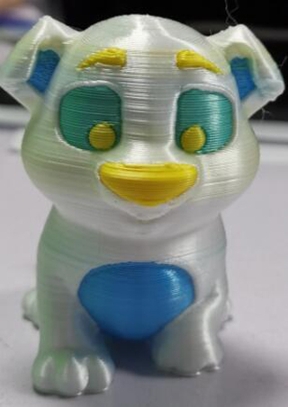

## Examples sliced by PrusaSlcier
:arrow_down: [Download gcode files](https://downgit.github.io/#/home?url=https://github.com/ZONESTAR3D/Upgrade-kit-guide/tree/main/HOTEND/E4%204-IN-1-OUT%20Non-Mixing%20Color%20Hotend/example/PrusaSlicer)  
#### Example 1. 3DBenchy

#### Example 2. 4 Color test 

#### Example 3. 4 Color Dog
    

#### Example 4. 4 Color owl

#### Example 5. 4 Color dog

#### Example 6. 4 Color Patrick

#### Example 7. 4 Color BDD

#### Slicing steps
##### Step 1. Choose printer Z9 + E4 HOTEND

##### Step 2. load 3mf file

##### Step 3. Change filament color 
- **Extruder #1**: Red
- **Extruder #2**: Transparent (use white)
- **Extruder #3**: White (use grey)
- **Extruder #4**: black

##### Step 4. print settings (only modified the support settings)

##### Step 5. filament settings (only modified the cooling settings)

##### Step 6. Check "blocked support" area

##### Step 7. Check "blocked support" area
The colors of these areas are drawn by the pain tool

##### Step 8. Start slicing and export gcode to SD card

