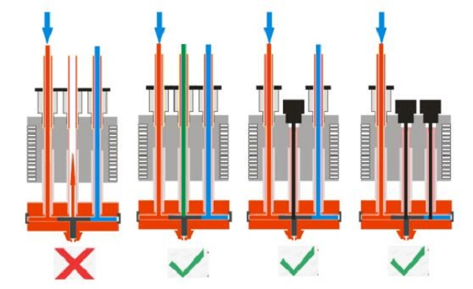
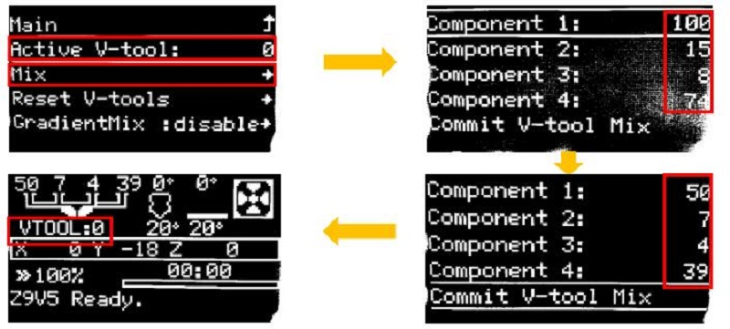
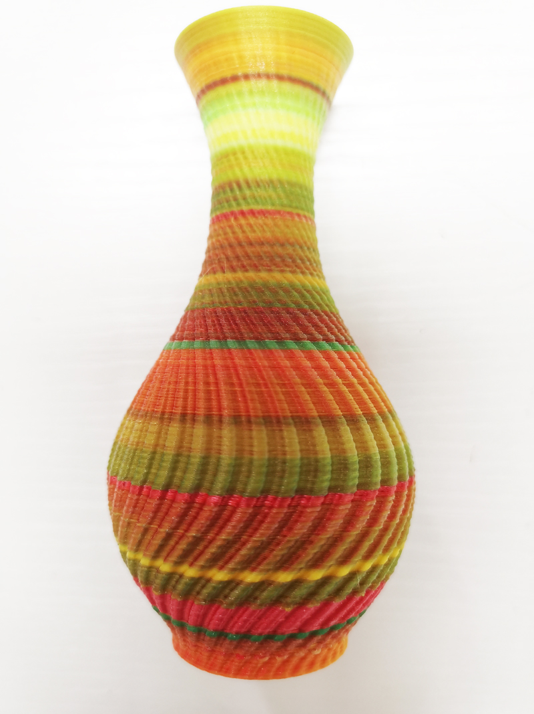

## User guide of M4-V3(V4) hotend
###:warning:ATTENTION
+ DONOT load / unload filament when the nozzle temperature is less than 150℃.

+ DONOT feed-in filament over 10mm if any of the channels is empty, otherwise may cause it be clogged, the correct way is
	+ Load filament to all channels at the same time.  
	+ Use a hotend clean tool to close empty channels.

### How to print singel color 3d object
+ Slicing a single color 3d mode file to gcode file.
+ Preheat the nozzle.
+ Use hotend clean tool to close the unused channle of hotend.
+ load filament to the hotend. **Recommend to load the filament to the center
channel.**
+ print gcode file from SD card.

### How to change printed color by adjust mixing rate    
+ Start to print a singel color gcode file from SD card.
+ Wait until the print start to print, set on the LCD menu.  
#### For 128x64 dots LCD screen
+ **Tune>>Mixer>>Mix>>Component1~4(M4):** Arbitrarily adjust the percentage of extruder 1 ~ 4,the range is 0 ~ 100.  
+ **Tune>>Mixer>>Mix>>Comit V-tool Mix:** Redistribute the percentage of all extruders in proportion and send it to the current vtool.  
After setting up, on the ideal menu shows VTOOL:0 

#### For 4.3" TFT-LCD  
+ **Tune>>Mixer>>Current V-TOOL:** Set the vtool to 0.   
+ **Tune>>Mixer>>Mix>>Extruder1~4(M4):** Arbitrarily adjust the percentage of extruder 1 ~ 4, the range is 0 ~ 100.  
+ **Tune>>Mixer>>Mix>>Comit:** Redistribute the percentage of all extruders in proportion and send it to the current vtool. The current vtool value changes color.
After setting up, on the ideal menu shows Current VTOOL = 0

### How to realize gradient printing

+ Start to print a singel color gcode file from SD card.  
+ Wait until the print start to print, set on the LCD menu.  
#### For 128x64 dots LCD screen
+ **Tune>>Mixer>>Gradient: disable>>**
	>
	> **Start Z:** set the start Z heigth(such as:0mm)  
	> **End Z:** set the END Z heigth(such as:200mm)  
	> **Start V-tool:** set the start V-tool(such as:0)   
	> **End V-tool:** set the end V-tool(such as:1)  
	After set Start Z isn’t equal to the End Z, and Start V-tool isn’t equal to End V-tool, the LCD will shows “Gradient : enable” and on the ideal menu shows gradient  

#### For 4.3" TFT-LCD
+ **Tune>>Mixer>>Gradient:OFF>>**
	>
	> **Start Z:** set the start Z heigth(such as:0mm)  
	> **End Z:** set the END Z heigth(such as:200mm)  
	> **Start V-tool:** set the start V-tool(such as:0)   
	> **End V-tool:** set the end V-tool(such as:1)  
	After set Start Z isn’t equal to the End Z, and Start V-tool isn’t equal to End V-tool, the LCD will shows “Gradient Mix Z:xxx->xxx V:xx->xx” and on the ideal menu shows gradient  

### How to realize random printing

+ Start to print a singel color gcode file from SD card.  
+ Wait until the print start to print, set on the LCD menu. 
#### For 128x64 dots LCD screen
+ **Tune>>Mixer>>Random Mix: disable>>**
	>
	> **Start Z:** set the start Z heigth(such as:0mm) End Z: set the END Z heigth(such as:200mm)
	> **Height:** set interval distance(such as:10mm), When the z-axis distance changes beyond this value, the mixing ratio changes randomly once.
	> **Extruders:** set the number of extruders with random variation(such as:4)
	After set Start Z isn’t equal to the End Z, the LCD will shows “Gradient : enable” and on the ideal menu shows random.

#### For 4.3" TFT-LCD
+ **Tune>>Mixer>>Random Mix: OFF>>**
	> **Start Z:** set the start Z heigth(such as:0mm) End Z: set the end Z heigth(such as:200mm)
	> **Height:** set interval distance(such as:10mm), When the z-axis distance changes beyond this value, the mixing ratio changes randomly once.
	> **Extruders:** set the number of extruders with random variation(such as:4)
	After set Start Z isn’t equal to the End Z, the LCD will shows “Random : ON” and on the printing menu shows: "Random Mix Z:xx->xx H:xx.x E:xx

### Realize gradient Random mixing by modifing gcode file
You can also add a M166/M167 command into the "start G-code" of the machine setting when slicing, so it can automatically work when print from SD card.  
  
+ **To add a "M166" command, it can start a "Gradient Mixing".**
> 
	Descitpion of M166 command
	M166: Start a gradient mix  
	S[bool] - Enable / disable gradients
	A[float] - Starting Z for the gradient
	Z[float] - Ending Z for the gradient.
	I[index] - V-Tool to use as the starting mix.
	J[index] - V-Tool to use as the ending mix.
	For example: M166 S1 A0 Z200 I0 J1
	S1->Enable gradient mix 
	A0->startZ is 0mm 
	Z200-> EndZ is 200mm 
	I0 -> Start V-tool is 0 
	J1 -> End Vtool is 1

+ **To add a "M167" command, it can start a "Random Mixing".**
> 
	Descitpion of M167 command.
	M167: Start a random mix.
	S[bool] - Enable / disable random mix.
	A[float] - Starting Z for the random.
	Z[float] - Ending Z for the random.
	H[float] - Minimum height of changing mixing rate.
	E[int] - how many extruders used on random mixing.
	For example: M167 S1 A0 Z100 H0.2 E3
	S1->Enable Random mix 
	A0->start Z heigth is 0mm 
	Z100->End Z heigth is 100mm 
	H0.2->change color every 0.2mm
	E3->3 extruders (Extruder#1 to Extruder#3) will be used

### Hot to print multi-color 3d objects
please refer to [**here**](./Example/readme.md)

## FAQ
#### **Hotend is clogged/blocked ?**  
If you encounter the problem of hot end clogged / blocked, please check according to the following items:  

+ **Check Slicing settings.**    
:red_circle: **Disable “Extruder/Nozzle switching retraction”.**
For example, set “Nozzle Switch Retraction Distance” to 0 in Cura.   
:red_circle: **Set the print speed low than 50mm/s.**  

+ **Check filament**    
:red_circle: **Don't mix different type of filament.**   
:bulb: Mixing ABS and PLA / PLA + is usually no problem, but PETG or silk PLA, wood-pla, transparent PLA and other materials mixed with many additives are usually easy to cause blockage.

+ **Check nozzle**  
:red_circle: There may be impurities in the filament that cannot melt, resulting in nozzle blockage.   
:key: Refer to the "How to clean the cloged mixing color hotend" to clean the hotend and replace a new nozzle.  
:red_circle: When printing, the first layer is too close, resulting in the nozzle scraping on the glass, or the front end of the nozzle may be damaged and blocked.  
:key: Refer to the "How to clean the cloged mixing color hotend" to clean the hotend and replace a new nozzle.   
  
+ **Check distance from nozzle to bed**  
:red_circle:If the distance from nozzle to bed is too closed, it will cause the filament can't flow out from the nozzle.   
:key: Double click the knob to fine tune the distance from the nozzle to the Printing platform.   
:bulb: When slicing, use the "shaft" base, and set the distance of the first layer to more than 0.5mm as far as possible, which can effectively reduce the trouble of adjusting the z-axis distance each time.  

+ **Check temperature of hot end**  
:red_circle: Hot end cooling fan must work when the nozzle temperature is over 50 degree, otherwise it will cause clogged because the inner PTFE tube overheat.  

+ **Check extruder motor**  
:key: Check whether the extruder is installed properly  
  
:key: Properly adjust the extruder pressure.

#### **Hotend is clogged/blocked ?**  

#### How to clean the cloged mixing color hotend
+ **Step 1:** Heat the hot end (nozzle) to 200 degrees and wait for the temperature to be reached
+ **Step 2:** Remove the fitting and pull out the filament (Figure 1).  
:sunny: **Tips1:** If it is difficult to pull out the filaments, you can use the cutting pliers to clamp the filaments and pull out (Figure 2).  
:sunny:**Tips2:** If the filaments cannot be pulled out at all, you can use cutting pliers to cut the filaments.  
+ **Step 3:** Remove the nozzle from the hot end.  
:memo: **Note:** Please pay attention to prevent burns, it is recommended to wear heat-resistant gloves for operation.  
+ **Step 4:** Install the hotend-clean-tool on the hot-end (Figure 3), close the channels that are not blocked, and leave only the blocked
channel.  
:sunny: **Tips:** If the hot end is blocked by filaments and cannot be inserted into the hotend-clean-tool, you can use a lighter to heat the thin rod of the hotend-clean-tool, and then insert it to the hotend(Figure 4).  
+ **Step 5:** Manually feed in at least 50cm filaments slowly from the hotend (Figure 5).  
+ **Step 6:** Clean the filaments in front of the hotend (Figure 6). If necessary (there are other channels are blocked), you can close the cleaned channel with a “hotend cleaning tool” before cleaning the next channel.  
+ **Step 7:** Install the nozzle back.  

### How to assemble/unaddemble M4-V3(V4) hotend
#### How to assemble M4 hotend

#### How to assemble M4 printhead

#### How to unassemble M4 printhead

