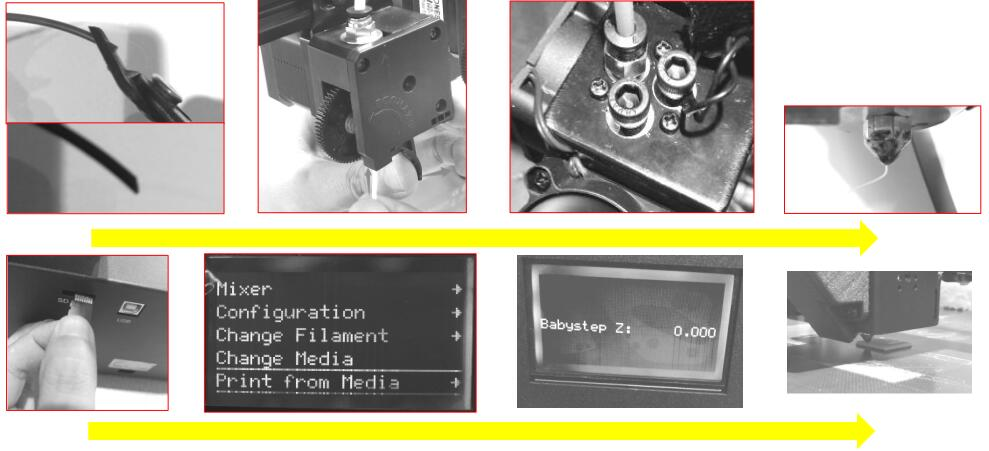
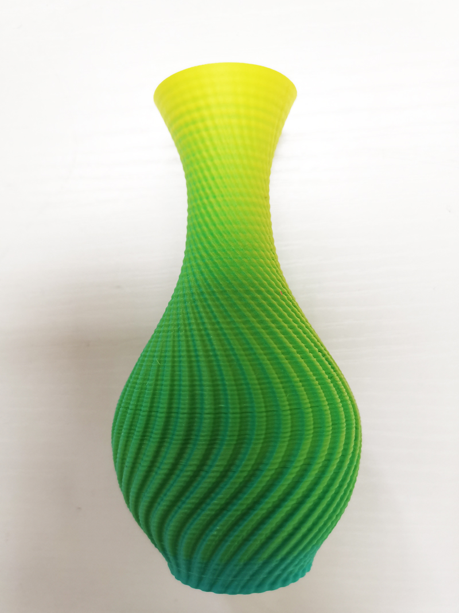
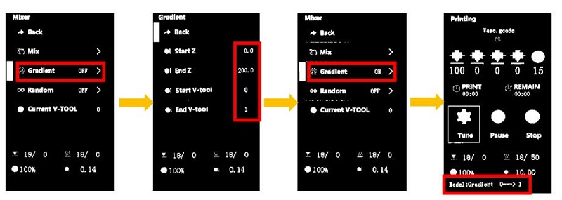

## User guide of M4-V3(V4) hotend
### 1. How to print singel color 3d object
+ Slicing a single color 3d mode file to gcode file.
+ Preheat the nozzle.
+ Use hotend clean tool to close the unused channle of hotend.
+ load filament to the hotend. **Recommend to load the filament to the center
channel.**
+ print gcode file from SD card.  

### 2. How to change printed color by adjust mixing rate    
+ Start to print a singel color gcode file from SD card.
+ Wait until the print start to print, set on the LCD menu.  
#### For 128x64 dots LCD screen
+ **Tune>>Mixer>>Mix>>Component1~4(M4):** Arbitrarily adjust the percentage of extruder 1 ~ 4,the range is 0 ~ 100.  
+ **Tune>>Mixer>>Mix>>Comit V-tool Mix:** Redistribute the percentage of all extruders in proportion and send it to the current vtool.  
After setting up, on the ideal menu shows VTOOL:0 

#### For 4.3" TFT-LCD  
+ **Tune>>Mixer>>Current V-TOOL:** Set the vtool to 0.   
+ **Tune>>Mixer>>Mix>>Extruder1~4(M4):** Arbitrarily adjust the percentage of extruder 1 ~ 4, the range is 0 ~ 100.  
+ **Tune>>Mixer>>Mix>>Comit:** Redistribute the percentage of all extruders in proportion and send it to the current vtool. The current vtool value changes color.
After setting up, on the ideal menu shows Current VTOOL = 0

### 3. How to realize gradient printing

+ Start to print a singel color gcode file from SD card.  
+ Wait until the print start to print, set on the LCD menu.  
#### For 128x64 dots LCD screen
+ **Tune>>Mixer>>Gradient: disable>>**
	>
	> **Start Z:** set the start Z heigth(such as:0mm)  
	> **End Z:** set the END Z heigth(such as:200mm)  
	> **Start V-tool:** set the start V-tool(such as:0)   
	> **End V-tool:** set the end V-tool(such as:1)  
	After set Start Z isn’t equal to the End Z, and Start V-tool isn’t equal to End V-tool, the LCD will shows “Gradient : enable” and on the ideal menu shows gradient  

#### For 4.3" TFT-LCD
+ **Tune>>Mixer>>Gradient:OFF>>**
	>
	> **Start Z:** set the start Z heigth(such as:0mm)  
	> **End Z:** set the END Z heigth(such as:200mm)  
	> **Start V-tool:** set the start V-tool(such as:0)   
	> **End V-tool:** set the end V-tool(such as:1)  
	After set Start Z isn’t equal to the End Z, and Start V-tool isn’t equal to End V-tool, the LCD will shows “Gradient Mix Z:xxx->xxx V:xx->xx” and on the ideal menu shows gradient  

#### Realize gradient mixing by modifing gcode file
You can also add a M166 command into the "start G-code" of the machine setting when slicing, so it can automatically work when print from SD card.  
  
+ **To add a "M166" command, it can start a "Gradient Mixing".**
> 
	Descitpion of M166 command
	M166: Start a gradient mix  
	S[bool] - Enable / disable gradients
	A[float] - Starting Z for the gradient
	Z[float] - Ending Z for the gradient.
	I[index] - V-Tool to use as the starting mix.
	J[index] - V-Tool to use as the ending mix.
	For example: M166 S1 A0 Z200 I0 J1
	S1->Enable gradient mix 
	A0->startZ is 0mm 
	Z200-> EndZ is 200mm 
	I0 -> Start V-tool is 0 
	J1 -> End Vtool is 1

### 4. How to realize random printing

+ Start to print a singel color gcode file from SD card.  
+ Wait until the print start to print, set on the LCD menu. 
#### For 128x64 dots LCD screen
+ **Tune>>Mixer>>Random Mix: disable>>**
	>
	> **Start Z:** set the start Z heigth(such as:0mm) End Z: set the END Z heigth(such as:200mm)
	> **Height:** set interval distance(such as:10mm), When the z-axis distance changes beyond this value, the mixing ratio changes randomly once.
	> **Extruders:** set the number of extruders with random variation(such as:4)
	After set Start Z isn’t equal to the End Z, the LCD will shows “Gradient : enable” and on the ideal menu shows random.

#### For 4.3" TFT-LCD
+ **Tune>>Mixer>>Random Mix: OFF>>**
	> **Start Z:** set the start Z heigth(such as:0mm) End Z: set the end Z heigth(such as:200mm)
	> **Height:** set interval distance(such as:10mm), When the z-axis distance changes beyond this value, the mixing ratio changes randomly once.
	> **Extruders:** set the number of extruders with random variation(such as:4)
	After set Start Z isn’t equal to the End Z, the LCD will shows “Random : ON” and on the printing menu shows: "Random Mix Z:xx->xx H:xx.x E:xx

#### Realize Random mixing by modifing gcode file
You can also add a M167 command into the "start G-code" of the machine setting when slicing, so it can automatically work when print from SD card.  

+ **To add a "M167" command, it can start a "Random Mixing".**
> 
	Descitpion of M167 command.
	M167: Start a random mix.
	S[bool] - Enable / disable random mix.
	A[float] - Starting Z for the random.
	Z[float] - Ending Z for the random.
	H[float] - Minimum height of changing mixing rate.
	E[int] - how many extruders used on random mixing.
	For example: M167 S1 A0 Z100 H0.2 E3
	S1->Enable Random mix 
	A0->start Z heigth is 0mm 
	Z100->End Z heigth is 100mm 
	H0.2->change color every 0.2mm
	E3->3 extruders (Extruder#1 to Extruder#3) will be used

### 5. Hot to print multi-color 3d objects
please refer to [**here**](../Example/readme.md)
